# 이재현 프로젝트 설명
팀명 : 투게더 <br>
이름 : 강현준(리더),김민호(코딩),이재현(디자인)... <br> 
운동일지를 적는 어플리케이션 <br>
포트폴리오 소개 사이트 : minho98.github.io <br>

[졸업작품소개]
- 작품명 : 운동 캘린더 <br>
- 개발환경 : 윈도우 (안드로이드 스튜디오) <br>
- 작품 소개 : 운동을 좋아하고 어떻게 관리하는지 길을 못잡고있는 사람들을 위해서 만들어내는 간단한 캘린더 형식의 운동관리 어플<br>
- 작품의 특징 : 자신이 운동을 어떻게했고 언제했는지 알수있고 다른운동의 방법을 알수있다<br>

<!-- [개발 일지]<br>
*최소한 일주일에 한번 (강의가 있는 날짜로 작성)<br>
ex) <br>
(03월23일) <br>
~~... <br>
내용은 자유 <br>
예) 회의 내용, 개발 과정, 오류해결, 보고서 작성(제출) <br> -->

## 0525 이재현 프로젝트
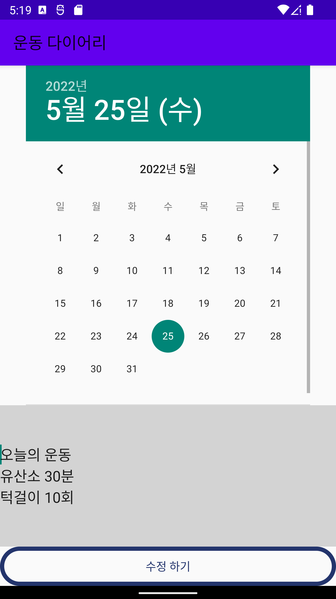<br>
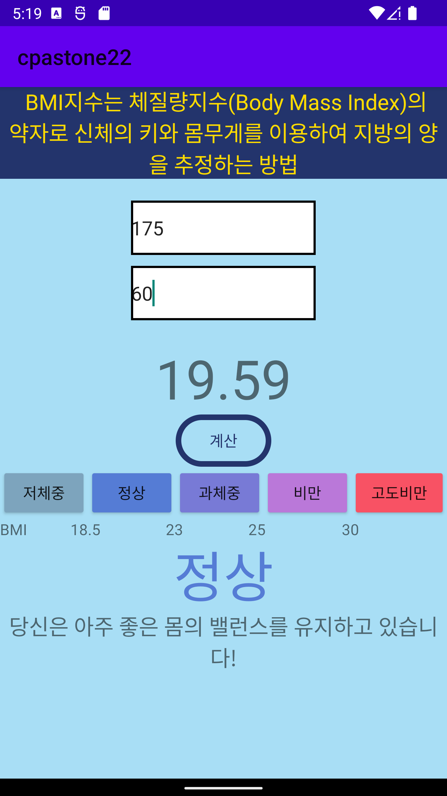<br>
<b>상세 운동 7개의 버튼을 제외</b>한 모든 버튼형식의 디자인을 하나로 통합하고 폰트 및 크기 조정


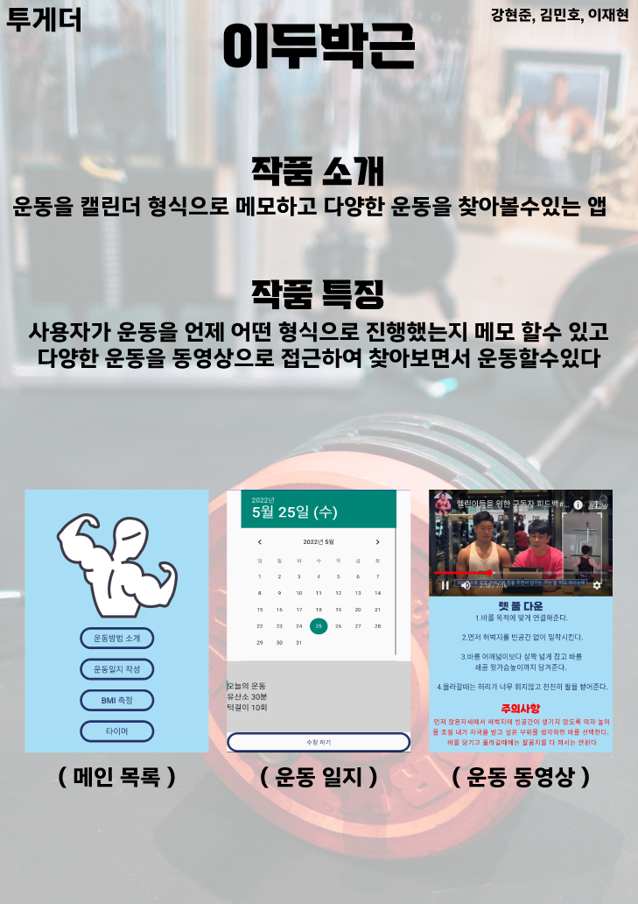<br>
일러스트를 이용하여 B4규격의 포스터를 제작하였다


## 0518 이재현 프로젝트

### Sub항목 버튼 디자인 변경
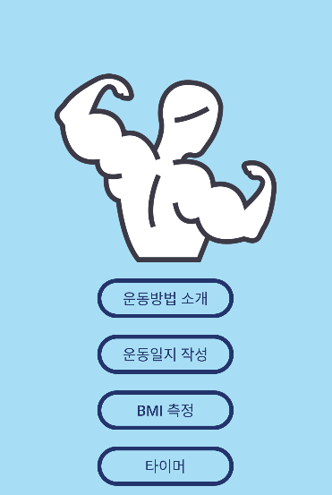<br>
버튼 디자인을 테두리 색상만 남기고 적용
```
parent="Theme.AppCompat.Light"
로 값을 변경 
기존 적용되어있던 값을 제외하고 새롭게 변경
```

### 메인화면 디자인 조정
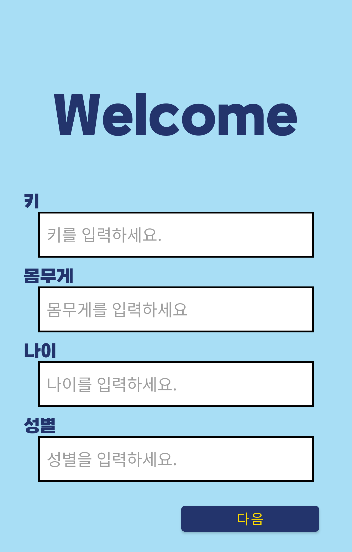<br>
제일 먼저 실행 하였을때 나오는 <br>
화면이 심심하다고 생각하여 위에 문구 하나를 추가


### 상.하체 버튼에서 (하체 버튼 동작 구현)
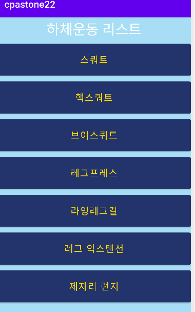<br>
상체와 똑같이 버튼 7개를 구현
<br>
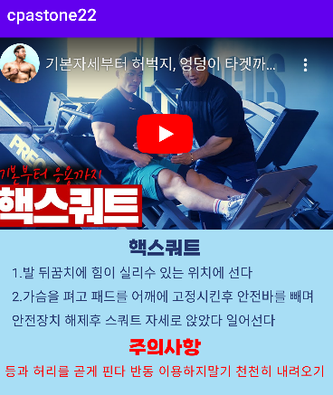<br>
상체와 마찬가지로 같이 동영상, 소개, 주의사항을 
적어서 작성하였다.

### BMI 결과창 색상 변경
```
setTextColor(Color.parseColor("#ba78d9"));

BMI 계산 측정값에 따라서 글자 색을 변경해주는 
java 코드를 작성
"Color.parseColor("#ba78d9")"를 추가하여 #000000값을 받는 색상코드로 변경해서 색을 적용 
```
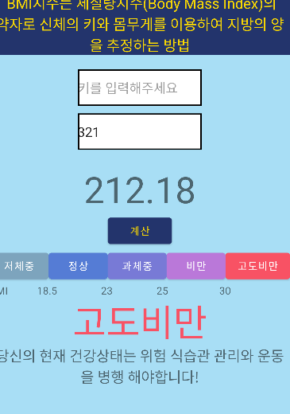<br>


## 0512 이재현 프로젝트

### 폰트 설정 및 크기 디자인 변경 <br>
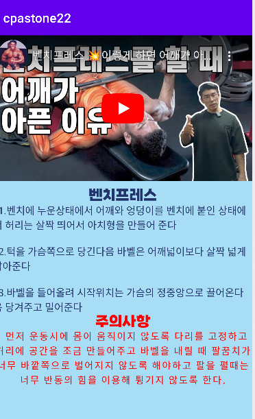
```
android:fontFamily="@font/kangwon_tt_bold"
폰트를 다운로드 받아서
font라는 폴더를 생성후 
받아오는 방식으로 폰트를 적용
```


## 0511 이재현 프로젝트

전체적인 UI 개선 <br>
BackGroundColor : #A8DEF5 <br>
btn color : #fddb00 <br>
text color : #23346C <br>
버튼 색상과 버튼 안에 있는 text color 변경<br>
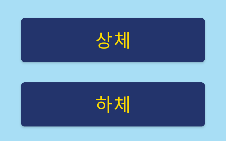
<br>

### 운동항목을 추가 및 버튼 눌렀을때 비디오와 운동 설명
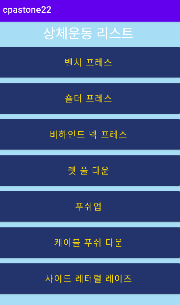
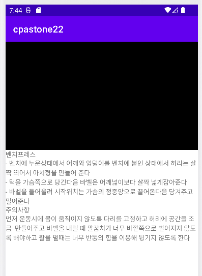
<br>


### 동영상 삽입

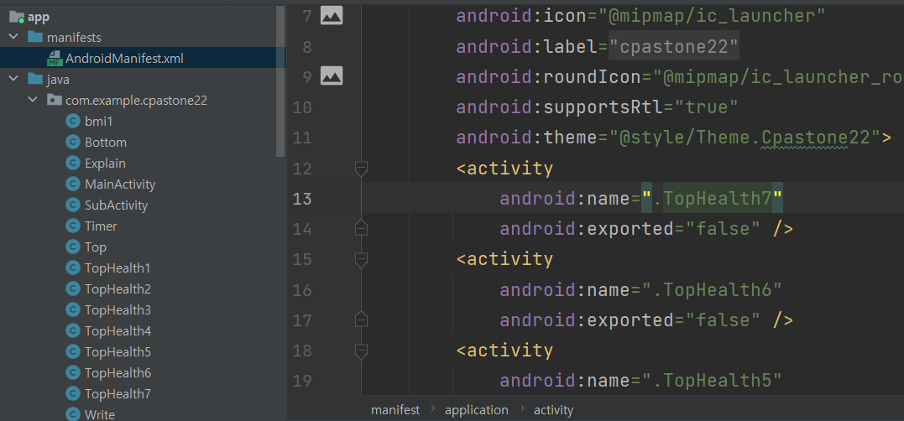 <br>
<b>manifests</b>에 있는 세부 설정값에서 
추가해주어야 동영상이 원활하게 재생이가능
```
<activity
            android:name=".TopHealth 1~7"
            android:exported="false" />
```
액티비티 값으로 1~7까지 적어서 동영상이 재생할수
있게끔 설정해주었음
<br>


## 0504 이재현 프로젝트
### 동영상 페이지 제작 [VideoView 적용]

<br>
<b>영상을 누르면 정지시킬수있는 '컨트롤바'적용</b>
<br>
<br>
운동상세페이지, 상체, 하체 버튼을 <br>
클릭시 운동 목록이 나오고 목록에서 다시 눌렀을때 <br>
위의 사진과같이 동영상, 운동명, 운동소개
크게 3가지가 나오게끔 제작

```
activity에 VideoView를 생성

<Java에서 import적용>
import android.media.MediaPlayer;
import android.net.Uri;
import android.os.Bundle;
import android.widget.MediaController;
import android.widget.VideoView;

activity에서 id를 주고 vv로 생성

videoUri = Uri.parse("android.resource://"+getPackageName()+"/"+ R.raw.plz);

->raw라는 폴더를 생성하고 plz라는.mp4파일을
적용

<uses-permission android:name="android.permission.INTERNET"/>
android:usesCleartextTraffic="true"

└ 위 두항목의 코드를 Internet에 있는 오픈 영상을 사용하기 위해서 사용

```

문제점 : 여러가지의 영상을 찾고 코드에 대입해야하는데 용량이 많을것으로 예상된다 

유튜브로 연동하려고했으나 저작권 문제가있어 보류


## 0427 이재현 프로젝트

### 타이머 기능 구현
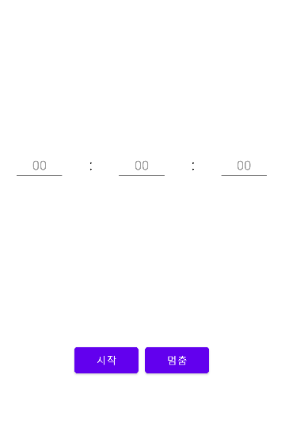
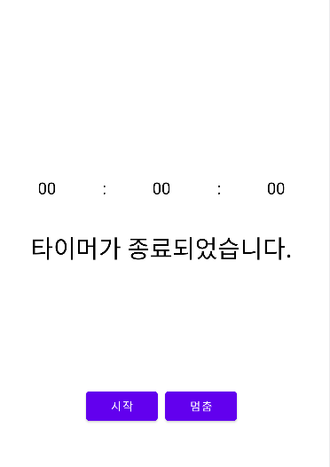

<br>
지난 프로젝트 시간에는 버튼만
구현이 되어있던 <br> <b>타이머</b> 기능을 구현
하단에 시작 버튼과 멈춤(stop)버튼을 구현하였고
현재 시작버튼만 Java와 연동하여 실행이가능
추후 멈춤(stop)버튼도 구현할 예정
<br>
타이머가 기능을 종료할시에 하단에 종료되었다는
text를 추가하여 종료되었음을 알림

```
import java.util.Timer;
import java.util.TimerTask;
└─ 타이머 기능을 위해 추가한 두가지의 import
```

### 메인화면 색상 재구성 
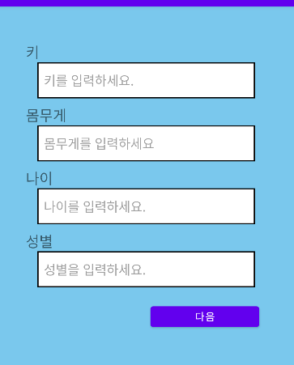
<br>
메인화면 색상 재구성 및 버튼에 적용되어있던 text 글자 수정 <br>
추후에 하단 BMI text값을 가운데로 적용한것을 토론한후에 괜찮다고 의견이 나오면 메인화면에도 적용할 예정 <br>
뒤에 단위 cm, kg, 세가 적용도 <b>추후 예정</b>

## BMI 재수정작업
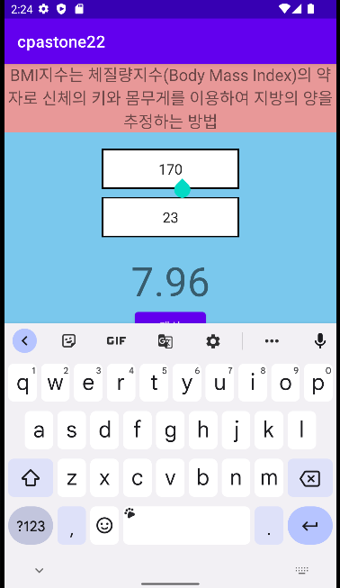
<br>
- 기존 UI에서 상자기준 좌측에서부터 시작되는 숫자값들의 입력을
가운데에서 시작할수있게끔 수정 <br>
- 키보드를 보면 알수있지만 현재 숫자말고도 입력이 가능하게되어있기에 숫자만 입력할수있게 코드 직업을 수정

```
android:textAlignment="center"
└ 텍스트값이 가운데로 오게끔 만들어주는 코드
android:inputType="number"
└ 키보드에 숫자값만 적을수있는 코드 
```


## 0413 이재현 프로젝트

## 메인화면 재수정작업
디자인을 구현한 PC에서 가동하였으나 열리지않아서 학교 PC에서 재구현하고 입력받는 속성값에 제한을 두어서 값을 넘기지 않도록 구현 <br> 
```
    <EditText
        android:id="@+id/height"
        android:layout_width="300dp"
        android:layout_height="50dp"
        android:layout_gravity="center"
        android:background="@drawable/color"
        android:hint="  키를 입력하세요."
        android:inputType="number"
        android:maxLength="3" />
```
코드에서 maxLength값을 지정해주면서 3자리 이상부터는 받지않도록
구현하였다 나머지 몸무게/나이/성별에도 같은 코드를 지정해주면서
제각각다른 값을 지정해주었다.

## BMI 계산창
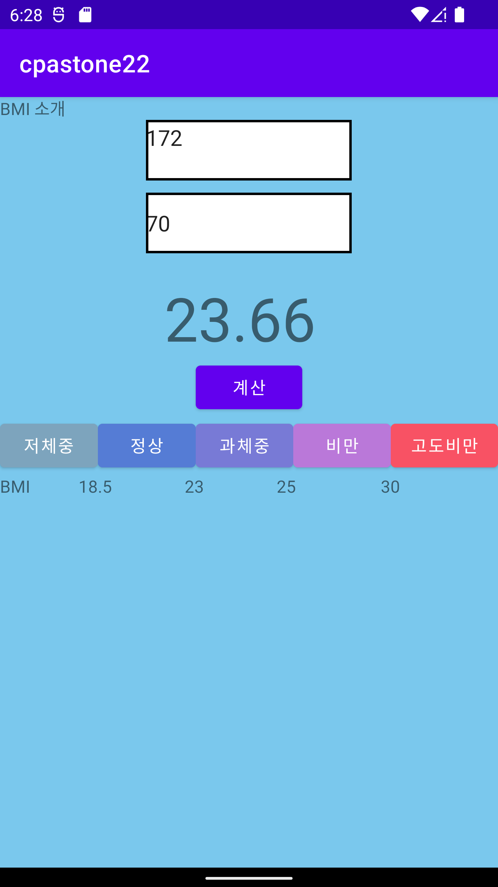

BMI 계산하는 결과값에서 계산할 "키"값과 "몸무게"값을 대입하고 <br>
계산을 누르면 밑에 23.66처럼 BMI 값이 나오는데 여기서 BMI를 확인하고 자신이 어느정도인지 확인할수있는 창을 만들었고<br> 
밑에 저체중 ~ 고도비만까지 각각의 색을 입혀서 경각심을 느끼게끔 제작을 해보았다. 

```
    <EditText
        android:id="@+id/height"
        android:layout_width="170dp"
        android:layout_height="50dp"
        android:layout_gravity="center"
        android:layout_marginTop="20dp"
        android:layout_marginBottom="10dp"
        android:maxLength="3"
        android:background="@drawable/color" />
```
background 부분에 @drawable을 적용하여서 <br>
html에서 css부분처럼 적용하여서 
EditText부분에 박스처럼 보이는 이미지를 생성 


<hr>

## 0406 이재현 프로젝트
### 0406 수정 작업 
##### 첫 화면

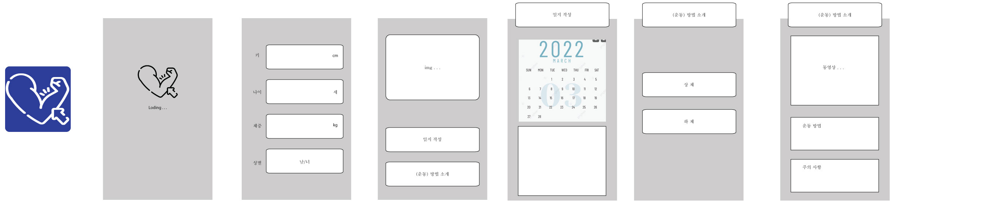
└─첫화면을 지정하고 뼈대를 지정하면서 기초 화면을 구현<br>
##### 실행시 메인으로 들어갈 화면
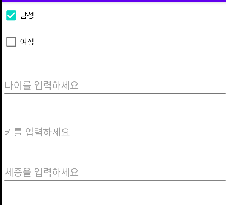

└─실행시 성별선택 및 개인정보를 입력하는 창을 생성
<br>
을 구현하였으나 디자인성이 부족하다고 느껴서 디자인 수정작업을
진행하였다.

### 수정 디자인
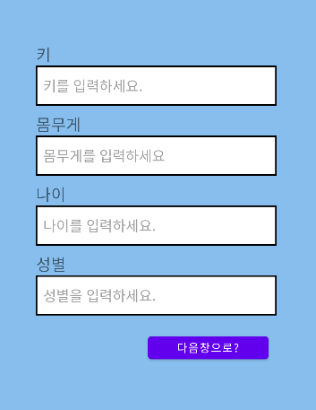
<br>
창이 잘들어갔는지 확인할수있게 백그라운드 색깔을 임의 지정하였고 <br>
다음창으로 넘어갈수있는 기능을 버튼으로 입력 받을 예정이기 때문에 임의의 버튼을 하나 생성하여 추가하였다.<br>
버튼으로 하나씩 제작하여서 추후에 자신이 해당하는 버튼을 누르면
그에 맞는 설명이 나오게끔 제작할 계획


## 0330 이재현 프로젝트

#### 큰 소개
일러스트로 기초적인 베이스 어플리케이션의 화면을 구현 제작 <br>
안드로이드를 사용해서 보이는 화면쪽을 구현하면서 제작하였다 <br>
추가적인 Java 및 코딩을 이용한 프로그래밍은 나중에 추가할 예정이다.<br>
##### 첫 화면

└─첫화면을 지정하고 뼈대를 지정하면서 기초 화면을 구현<br>
##### 실행시 메인으로 들어갈 화면


└─실행시 성별선택 및 개인정보를 입력하는 창을 생성
<br>

#### 운동부위별 소개  img
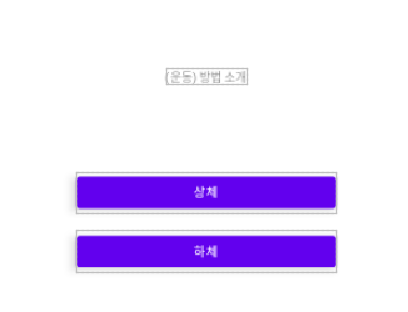<br>
└─운동 방법소개에서 운동부위를 크게 2개를 선정해서 버튼형식(터치)으로 생성하였음 

##### 로딩부분
 <br>
└─로딩 어플리케이션이 실행중 또는 서브페이지 부분에 추가하여 운동이라는 캘린더의 이미지를 부각
<br>

#### 메인아이콘 img
<br>
└─앱으로 추출하게된다면 메인 아이콘으로 설정이 될것같다
<br>

## 0323 이재현 프로젝트

GitHub <br>
github.com : Repo 생성, 본인 id와 동일 <br>
[id] github.io <br>

임의의 Repo, 생성후 page생성
[id].github.io/[repo,Name]

#### Team

APP Web Design 공히 GitHubPage로 소개 페이지 작성 <br>
사이트 이름은 자유 (Repo,이름) <br>
대표사이트는 팀별로 1개 사이트 <br>
본인의 포트폴리오로 활용하려면 개인적으로 만들기 가능 <br>

#### <개인>
GitHub Repo, 이름을 capstone22로 생성해서 README.md파일 생성 <br>

